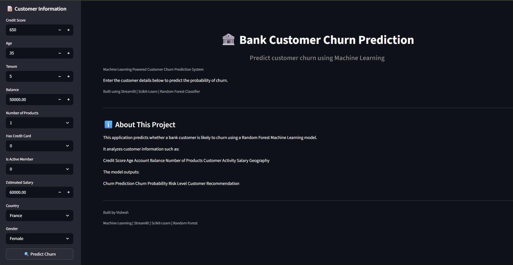
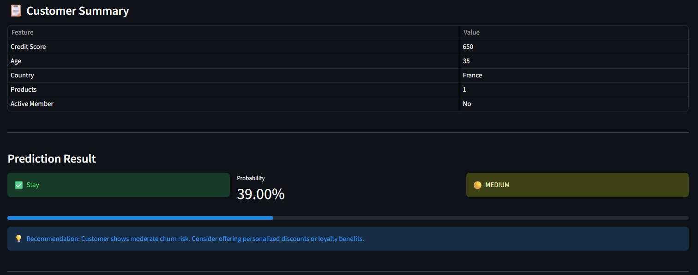
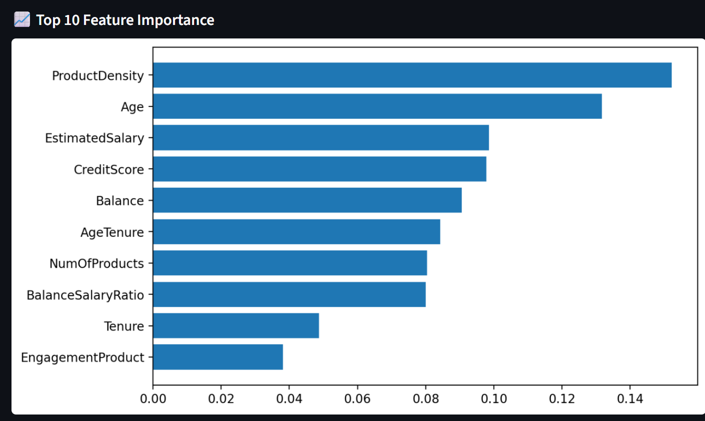
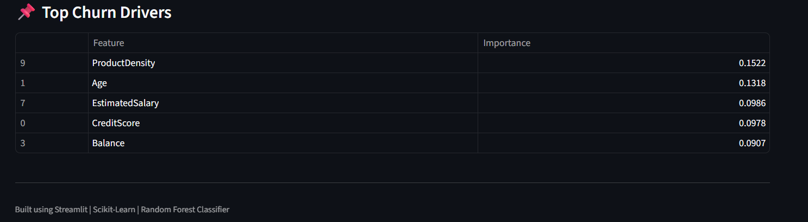
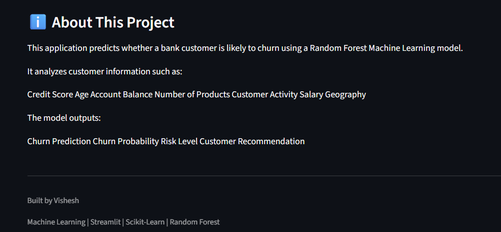

# 🏦 Bank Customer Churn Prediction

[](https://churn-predictor-99.streamlit.app/)
[](https://python.org)
[](https://scikit-learn.org)

Predict customer churn using Machine Learning and explore the results through an interactive Streamlit dashboard.

A Machine Learning-powered web application that predicts whether a bank customer is likely to churn based on customer information such as age, balance, credit score, products owned, activity status, and salary.

The project uses Random Forest Classification and is deployed as an interactive Streamlit application.

---

# 📌 Project Overview

Customer churn is one of the biggest challenges faced by banks.

This project predicts customer churn before it happens, allowing banks to identify high-risk customers and take proactive retention measures.

The application provides:

- Churn Prediction
- Churn Probability
- Risk Level
- Customer Summary
- Feature Importance
- Top Churn Drivers
- Personalized Recommendation

---

# 🚀 Features

- Customer Churn Prediction
- Random Forest Machine Learning Model
- Feature Engineering
- Probability Score
- Risk Classification
- Recommendation System
- Interactive Streamlit Dashboard
- Feature Importance Visualization

---

# 📂 Dataset

The dataset contains customer information such as:

- Credit Score
- Geography
- Gender
- Age
- Tenure
- Balance
- Number of Products
- Credit Card Status
- Active Member Status
- Estimated Salary

Target Variable:

- Exited
    - 1 = Customer Churned
    - 0 = Customer Stayed

---

# 🤖 Machine Learning Models

Models compared:

- Logistic Regression
- Decision Tree
- Random Forest

Random Forest achieved the best performance and was selected for deployment.

---

# 📊 Model Performance

| Model | Accuracy |
|--------|-----------|
| Logistic Regression | 80.8% |
| Decision Tree | 85.6% |
| Random Forest | **86.45%** |

---

# 🛠 Tech Stack

- Python
- Pandas
- NumPy
- Matplotlib
- Scikit-Learn
- Joblib
- Streamlit

---

# 📸 Screenshots

## Dashboard



## Prediction Result



## Feature Importance



## Top Churn Drivers



## About The Project



---

# ▶️ Installation

Clone the repository

```bash
git clone https://github.com/yourusername/Bank-Customer-Churn-Prediction.git
```

Go inside the folder

```bash
cd Bank-Customer-Churn-Prediction
```

Install dependencies

```bash
pip install -r requirements.txt
```

Run the application

```bash
streamlit run app.py
```

---

# 📁 Project Structure

```
Bank-Customer-Churn-Prediction/
│
├── app.py
├── churn_analysis.ipynb
├── bank_churn_model.pkl
├── scaler.pkl
├── European_Bank.csv
├── requirements.txt
├── README.md
└── images/
```

---

# 📈 Future Improvements

- SHAP Explainability
- XGBoost Model
- Live Database Integration
- Cloud Deployment
- User Authentication

---

# 👨‍💻 Author

**Vishesh**

Machine Learning | Python | Streamlit